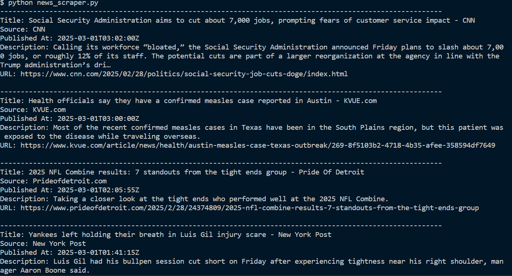

# News Scraper

## Overview
This project is a web scraper that fetches the top news headlines from the NewsAPI. It allows users to easily access the latest news articles based on selected categories and countries.

## Features
- Fetches the top headlines from the NewsAPI.
- Supports filtering by country and category.
- Displays article details including title, source, publication date, description, and URL.

## Technologies Used
- Python
- Requests library
- NewsAPI

## Future Enhancements
- Implement a web interface using Flask or Django.
- Save articles to a database for easy access and filtering.
- Add user preferences for personalized news delivery.
- Expand to include additional news sources or categories.

## Learning Outcomes
- Gained hands-on experience working with APIs and handling JSON data.
- Improved Python programming skills.
- Learned how to structure a project for clarity and usability.

